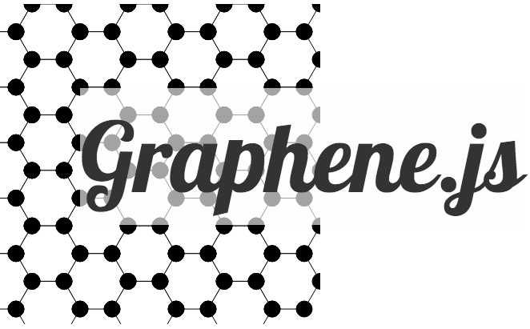

# Creating the Graphene Logo... with Graphene!

See the 'live' version of the logo [here](http://stanleygu.com/graphene-logo/).



## Getting started

System Requirements:

* `node.js`

In this tutorial, we will be using [yeoman](http://yeoman.io/) to quickly scaffold a new angular app.

```
npm install -g yo generator-angular grunt-cli bower # you might need sudo here depending on your node installation
```

Now generate an angular project using yeoman.

`yo angular graphene-logo`

## Installing Graphene

Install graphene using `bower`:

`bower install --save stanleygu/graphene#gh-pages`

## Building the logo

Inside [`app.js`](https://github.com/stanleygu/graphene-logo/blob/master/app/scripts/app.js):

    angular
      .module('grapheneLogoApp', ['sg.graphene']);

Inside [`main.js`](https://github.com/stanleygu/graphene-logo/blob/master/app/scripts/controllers/main.js):

    var height = 400;
    var width = 400;
    var nodes = [];
    var paths = [];
    var size = 20; // 'radius' of each hexagon, middle to vertex
    var nodeSize = 5;

    var centerToEdge = size * Math.sin(Math.PI / 3);
    var edge = 2 * size * Math.cos(Math.PI / 3);
    var vRange = _.range(0, height, 2 * centerToEdge);
    var hRange = _.range(0, width, edge / 2 + size);
    var angles = _.range(0, 360, 60);

    var addHexagonNodes = function(size, x, y, nodes) {
      var addNode = function(deg, x, y, nodes, size) {
        nodes.push({
          x: x + size * Math.cos(deg * Math.PI / 180),
          y: y + size * Math.sin(deg * Math.PI / 180)
        });
      };
      _.each(angles, function(angle) {
        addNode(angle, x, y, nodes, size);
      });
    };
    var makePath = function(x, y, size) {
      var d = 'M ' + (x + size * Math.cos(-Math.PI / 3)) + ' ' + (y + size * Math.sin(-Math.PI / 3));
      _.each(angles, function(angle) {
        d += ' ' + (x + size * Math.cos(angle * Math.PI / 180)) + ' ' + (y + size * Math.sin(angle * Math.PI / 180));
      });

      return d;
    };

    _.each(vRange, function(y) {
      _.each(hRange, function(x, ix) {
        if (ix % 2 === 0) {
          addHexagonNodes(size, x, y, nodes);
          paths.push({
            d: makePath(x, y, size)
          });
        } else {
          var offset = centerToEdge;
          addHexagonNodes(size, x, y + offset, nodes);
          paths.push({
            d: makePath(x, y + offset, size)
          });
        }
      });

    });

    $scope.exports = {
      height: height,
      width: width,
      nodes: nodes,
      paths: paths,
      nodeSize: nodeSize
    };

Inside the `template.html` file:

    <svg 
      xmlns="http://www.w3.org/2000/svg"
      case-sensitive="viewBox"
      ng-attr-height="{{imports.height || 800}}"
      ng-attr-width="{{imports.width || 800}}"
      ng-attr-viewBox="0 0 300 300"
      style="position: absolute;"
      >
      <g
        ng-repeat="path in imports.paths"
      >
        <path
          ng-attr-d="{{path.d}}" 
          stroke="black" 
          ng-attr-fill="{{path.fill || 'white'}}"
          ng-mouseover="path.fill = 'green'"
          ng-mouseleave="path.fill = 'white'"
        >
      </g>
      <g
        ng-repeat="node in imports.nodes"
        ng-attr-transform="translate({{node.x}},{{node.y}})"
      >
        <circle
          ng-attr-r={{imports.nodeSize}}
          fill="black"
          stroke="black"
        />
      </g>
    </svg>

